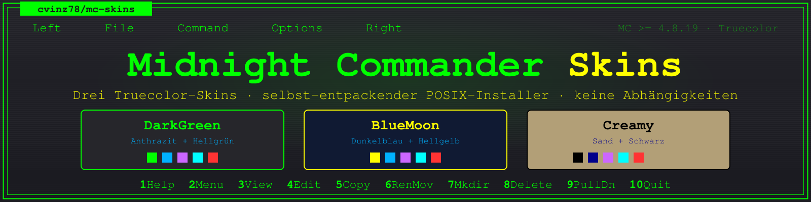
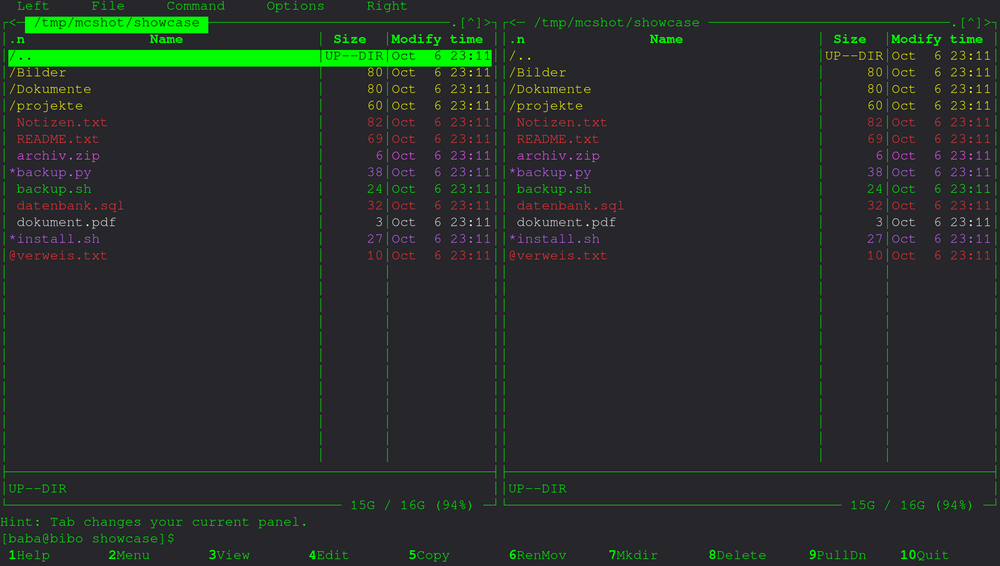
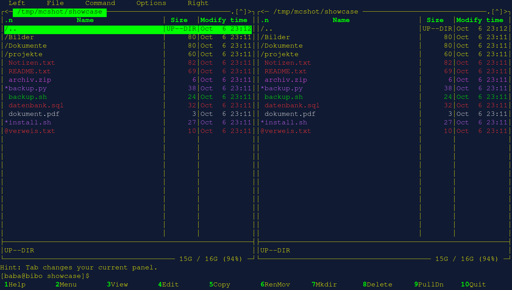
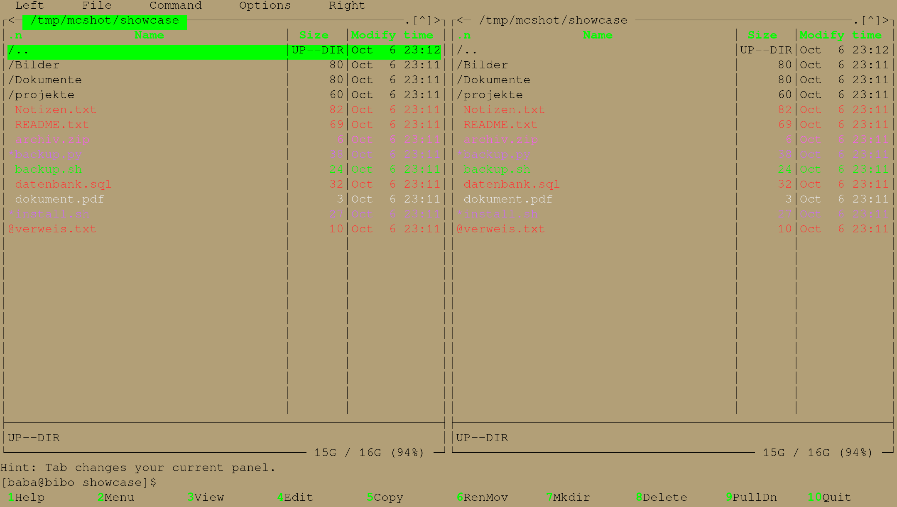

# Midnight Commander Skins — DarkGreen · BlueMoon · Creamy

Drei Truecolor-Farbschemas für den [Midnight Commander](https://midnight-commander.org/)
plus ein **selbst-entpackendes POSIX-Installations-Script**, das alle Dateien
eingebettet enthält und auf Arch, Ubuntu/Debian und Alpine (busybox ash)
läuft — ohne Abhängigkeiten, ohne sudo, ohne Installation über den
Paketmanager.


| DarkGreen | BlueMoon | Creamy |
|:---:|:---:|:---:|
|  |  |  |
| Anthrazit + Hellgrün | Dunkelblau + Hellgelb | Sand + Schwarz |

*(Echte Renderläufe von Midnight Commander 4.8.33 im Truecolor-Terminal.)*

---

## Inhalt

- [Schnellstart](#schnellstart)
- [Voraussetzungen](#voraussetzungen)
- [Installer-Referenz](#installer-referenz)
- [Die Skins](#die-skins)
- [Datei-Farbgebung](#datei-farbgebung)
- [Farben anpassen](#farben-anpassen)
- [Fehlerbehebung](#fehlerbehebung)
- [Wie es funktioniert](#wie-es-funktioniert)
- [Lizenz](#lizenz)
- [English](#english)

## Schnellstart

```sh
./mc-skins.sh              # alle drei Skins installieren
./mc-skins.sh -a Creamy    # einen dauerhaft aktivieren (MC danach neu starten!)
```

Oder im MC: **F9 → Optionen → Aussehen → Skin wählen**, dann
**F9 → Optionen → Konfiguration speichern**.
Zum Ausprobieren ohne Änderung der Konfiguration: `mc -S Creamy`.

Installiert wird Benutzer-weise nach `~/.local/share/mc/skins/` und
`~/.config/mc/` — **nicht mit sudo ausführen!** (Das Script warnt vor
sudo/root.)

## Voraussetzungen

- Midnight Commander **≥ 4.8.19** (getestet mit 4.8.30–4.8.33, S-Lang)
- Terminal mit **Truecolor** (`echo $COLORTERM` sollte `truecolor` oder
  `24bit` melden — moderne Terminals wie GNOME Terminal, Konsole, xterm,
  alacritty, kitty, foot tun das von Haus aus)
- POSIX-Shell (`sh`, dash, ash, bash — keine Bashismen im Script)
- `filehighlight.ini` wird mitinstalliert und ersetzt die Systemdatei —
  sie ist nötig für die Farbgebung nach Dateityp

## Installer-Referenz

| Option | Funktion |
|---|---|
| *(ohne)* | Alle drei Skins + `filehighlight.ini` installieren (bestehende Dateien werden gesichert) |
| `-i SKIN` | Nur einen Skin installieren (`DarkGreen`, `BlueMoon`, `Creamy`) |
| `-a SKIN` | Skin dauerhaft in `~/.config/mc/ini` aktivieren — mit Backup und Warnungen, wenn MC läuft oder das Script per sudo lief |
| `-x [DIR]` | Eingebettete Dateien entpacken: 3 Skins + `filehighlight.ini` + `Anleitung.txt` (deutsch) + `Manual.txt` (englisch). Standard: `./mc-skins` |
| `-r DIR` | Überarbeitete Dateien aus DIR in ein **neues** Installer-Script verpacken (Ausgabe `DIR/mc-skins-installer.sh`, Version automatisch +0.1) |
| `-de` / `-en` | Ausgabesprache Deutsch/Englisch (Standard: `-de`; dauerhaft umstellbar über `LANG_MODE` oben im Script) |
| `-nc` | Script-Ausgaben ohne Farben (für ältere Terminals; aktiviert sich automatisch, wenn die Ausgabe kein Terminal ist) |
| `-h` | Hilfe |

Das Script ist **beliebig umbenennbar** — Hilfe und Anleitung erkennen
automatisch den aktuellen Namen.

## Die Skins

| Skin | Hintergrund | Rahmen/Menüs | Normale Dateien | Besonderheit |
|---|---|---|---|---|
| **DarkGreen** | Anthrazit `#26262b` | Hellgrün `#00ff00` | Hellblau `#00b2ff` | Neongrün-Klassiker |
| **BlueMoon** | Dunkelblau `#101a33` | Hellgelb `#ffff00` | Hellblau `#00b2ff` | Dialoge gelb (MC-interner Zwang: Dialograhmen = Dialogtext) |
| **Creamy** | Sand `#b29f77` | Schwarz `#000000` | Dunkelblau `#00008b` | Wo die anderen Hellgelb nutzen, steht hier Schwarz |

Alle Skins nutzen dieselbe Dateitypen-Farbgebung (siehe unten), einen
grünen Auswahlbalken (Schwarz auf Hellgrün) und decken **jede** MC-Ansicht
ab: Panels, Dialoge, Menüs, Editor (mcedit), Viewer, Diff-Ansicht, Hilfe,
Fehlerfenster.

## Datei-Farbgebung

MC liest (anders als `ls`) keine `LS_COLORS`-Variable — die Farbgebung nach
Dateityp entsteht aus der Skin-Sektion `[filehighlight]` zusammen mit der
mitgelieferten `~/.config/mc/filehighlight.ini`. Dort bestimmt die
**Reihenfolge die Priorität** (erster Treffer gewinnt):

| Typ | Farbe (DarkGreen/BlueMoon) | Farbe (Creamy) |
|---|---|---|
| Verzeichnisse | Hellgelb | Schwarz |
| Normale Dateien | Hellblau | Dunkelblau |
| Ausführbare Dateien | Hell Lila `#cc66ff` | Hell Lila |
| Symlinks | Hellcyan `#00ffff` | Hellcyan |
| `*.txt` | Hellrot `#ff3333` | Hellrot |
| `*.sh`, `*.py` | Hellgrün `#00ff00` | Hellgrün |
| Archive, Devices | Magenta `#ff55ff` | Magenta |
| Dokumente (`*.pdf`, `*.doc` …) | Weiß | Weiß |
| Datenbanken | Hellrot | Hellrot |

## Farben anpassen

Alle Farben stehen als Hexcode (`#rrggbb`) direkt in den Skin-Dateien
(`~/.local/share/mc/skins/*.ini`). Jede Farbzeile hat einen erklärenden
Kommentar **darüber**, im Skin-Kopf gibt es eine zentrale Farb-Legende.
Ein gezielter Tausch geht auch global:

```sh
sed -i 's/#26262b/#2a2a30/g' ~/.local/share/mc/skins/DarkGreen.ini
```

**Wichtig:** Keine Kommentare **hinter** Wertzeilen ergänzen — der
ini-Parser (GKeyFile) liest sie als Teil des Wertes und zerstört den Skin.

Wer dauerhaft eigene Versionen pflegt: Dateien mit `-x` entpacken, anpassen,
und mit `-r DIR` ein neues Installer-Script bauen (Version erhöht sich
automatisch um 0.1).

## Fehlerbehebung

| Symptom | Ursache/Lösung |
|---|---|
| Skin erscheint nicht / alte Farben | MC **neu starten**. Lief MC während `-a`? (MC schreibt die alte Einstellung beim Beenden zurück — das Script warnt.) |
| Alles grau / nur 16 Farben | `COLORTERM=truecolor` gesetzt? Terminal überhaupt Truecolor-fähig? |
| Dateien alle gleichfarbig | `~/.config/mc/filehighlight.ini` fehlt oder MC-Panel-Option „Dateien hervorheben" ist aus (F9 → Optionen → Panel) |
| „Kann Skin nicht parsen" | Kommentar hinter einer Wertzeile oder unvollständige Skin-Datei — einfach per Script neu installieren |
| Skin nicht gefunden | `ls ~/.local/share/mc/skins/` — Name exakt prüfen (Groß-/Kleinschreibung) |
| Farben landen in /root | Script mit sudo gelaufen — als normaler Benutzer OHNE sudo ausführen |

## Wie es funktioniert

Das Script ist **selbst-entpackend**: Die drei Skin-Dateien, die
`filehighlight.ini` und die zweisprachigen Anleitungen liegen als
Heredocs in `emit_*()`-Funktionen eingebettet im Script selbst — eine
einzige Datei, die alles enthält. `sh -n`-sauberes POSIX (`dash`, busybox
ash und bash laufen), Arithmetik per `awk`, keine Bashisms.

Mit `-r` kann das Script sogar **sich selbst neu generieren**: es liest
seine eigene Struktur über eindeutige Marker, ersetzt die eingebetteten
Dateien durch die überarbeiteten Versionen aus einem Ordner und erhöht die
Versionsnummer — so bleiben bearbeitete Skins in einem einzigen,
weitervertreibbaren Script.

## Lizenz

Lizenziert unter der [GNU General Public License v3](LICENSE).

---

## English

Three truecolor color schemes for the [Midnight Commander](https://midnight-commander.org/)
plus a **self-extracting POSIX installer** with all files embedded — one
script, no dependencies, runs on Arch, Ubuntu/Debian and Alpine (busybox ash).

| Skin | Background | Frames | Regular files |
|---|---|---|---|
| **DarkGreen** | Anthracite `#26262b` | Bright green `#00ff00` | Light blue `#00b2ff` |
| **BlueMoon** | Dark blue `#101a33` | Bright yellow `#ffff00` | Light blue `#00b2ff` |
| **Creamy** | Sand `#b29f77` | Black `#000000` | Dark blue `#00008b` |

**Quick start:**

```sh
./mc-skins.sh              # install all three skins
./mc-skins.sh -a Creamy    # activate one permanently (restart MC afterwards)
./mc-skins.sh -en          # English output (default: German)
```

**Requirements:** MC ≥ 4.8.19 and a truecolor terminal (`COLORTERM=truecolor`).
Installs per user into `~/.local/share/mc/skins/` and `~/.config/mc/` —
do **not** run with sudo.

**Options:** *(none)* = install all · `-i SKIN` = install one skin ·
`-a SKIN` = activate · `-x [DIR]` = extract embedded files (skins +
filehighlight.ini + German/English manuals) · `-r DIR` = repack edited
files into a NEW installer script (version auto +0.1) · `-de`/`-en` =
output language · `-nc` = no colors in script output (automatic when
piped) · `-h` = help. The script may be renamed freely.

File-type coloring (directories yellow/black, executables purple
`#cc66ff`, symlinks cyan, `*.txt` red, `*.sh`/`*.py` green, archives
magenta, documents white) is provided by the bundled
`~/.config/mc/filehighlight.ini` — order defines priority, first match
wins. All colors are plain `#rrggbb` hex codes inside the skin files,
with a legend at the top of each skin; edit them to taste.

Licensed under the [GNU General Public License v3](LICENSE).
